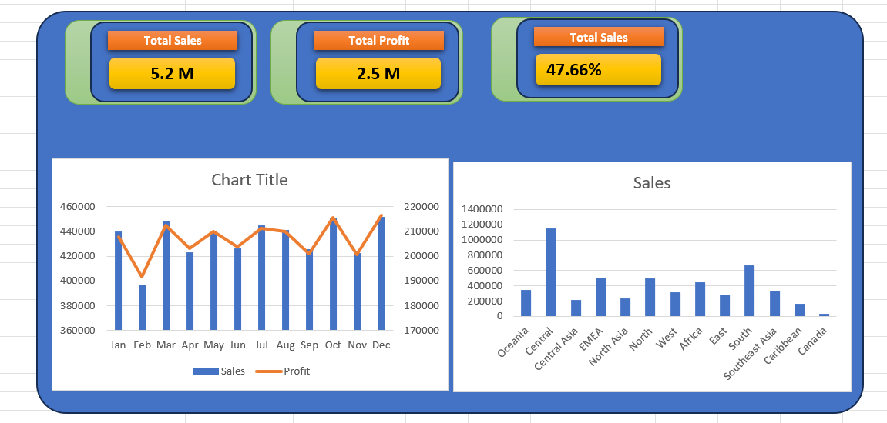

# 📊 Sales Data Analysis Dashboard

## 🔍 Project Overview
This project focuses on analyzing sales data to generate meaningful business insights and support decision-making.

## 🛠 Tools & Technologies
- Excel
- SQL
- Data Analysis
- Data Visualization

## 📈 Key Insights
- Identified top-performing products
- Analyzed monthly sales trends
- Evaluated revenue growth
- Improved reporting efficiency

## 📂 Project Files
- Sales Dashboard (Excel)
- Dataset
- SQL Queries

## 🎯 Objective
To transform raw sales data into actionable insights using analytical techniques and dashboards.
